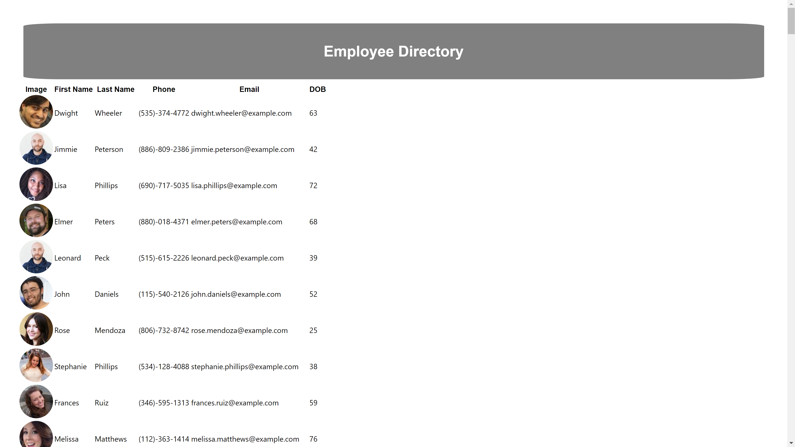

# employee_directory 

## Description

This application creates an employee directory using React components. 

--------------------

## User Story

As a user, I would like to be able to view my entire employee directory at once so that I have quick access to my employee's information.

---------------------

## Acceptance Criteria

-   The User should be able to sort the table by at least one category.

-   The User should be able to filter the employees by at least one property. 

---------------------

## Links 

-   [Github] (https://github.com/nescalante92/employee_directory)
-   [Deployed Site] (https://shielded-beach-75674.herokuapp.com/)

---------------------

## Mock Image

